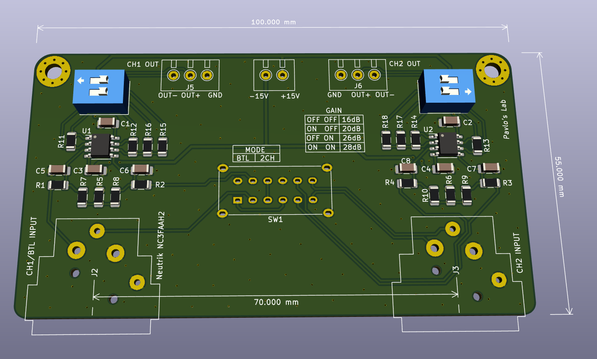
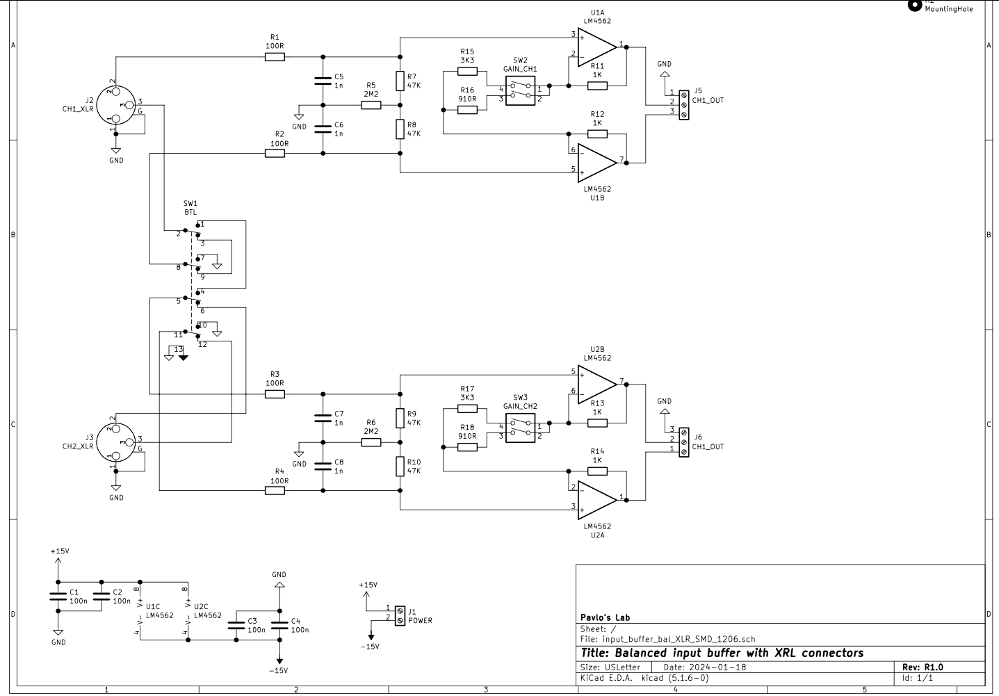

# Input buffer for amplifier with balanced inputs

This buffer serves as an impedance matching and is implemented on the board that allows for balanced XLR inputs for two channels.

## PCB rendered in 3d:

## Schematics:

Opamps can be NE5532 or LM4562 or any other with good unity gain stability. Preferred opamp with superior open loop gain is OPA1656.

Input XLR connectors are Neutrik NC3FAAH2.

Capacitors for input low pass filters are C0G or NP0 type. Decoupling capacitors are X7R 100nF or higher (1uF will work great).

## PCB layout:

Bottom layer is GND. Top layer is signal + power and GND poured in between. Stiching vias are then applied to connect bottom and top GND planes to ensure those are as close to 0 as possible.

